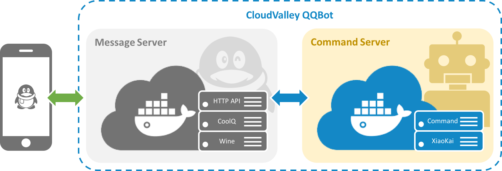

# CloudValley QQBot : Command Server
【云谷QQ机器人】之「指令服务器」

[](https://github.com/waylonwang/cmd-server/master/LICENSE)
[](https://hub.docker.com/r/cloudvalley/cmd-server/)

## CloudValley QQBot项目
### 业务架构
【CloudValley QQBot】项目计划实现一个自动处理消息指令的QQ机器人来处理一些私有项目上的需求，本服务器是【CloudValley QQBot】项目的关键组成部分，基于[CCZU-DEV/xiaokai-bot](https://github.com/CCZU-DEV/xiaokai-bot)改造的指令服务器，用于VPS挂机实现QQ指令处理服务。



【CloudValley QQBot】项目的另一关键组成部分是基于[CoolQ/docker-wine-coolq](https://github.com/CoolQ/docker-wine-coolq)(CoolQ)镜像和[richardchien/coolq-http-api](https://github.com/richardchien/coolq-http-api)(HTTP API)插件整合的[waylonwang/cmd-server](https://github.com/waylonwang/msg-server)(「Message Server」)消息服务器，用于提供本服务器消息源及消息收发的处理。

### 技术选型
【CloudValley QQBot】项目尝试了GitHub上基于SmartQQ(Web QQ) API的众多开源项目，包括采用nodejs、perl、python等语言实现的QQBot，这些QQBot除了少量特性（如@用户）无法实现外，基本的IM需求和群管需求还是可以满足的，其中部分QQBot甚至采用了插件机制得以将业务处理的逻辑与框架主体分离实现松耦合，但是由于SmartQQ并非腾讯发展的重点，且貌似已不再维护，因此采用Web QQ协议的项目都先天存在风险，尤其是时不时一些API被关停或调整影响了机器人的稳定性，因此依赖于SmartQQ存在着极大的风险。

【CloudValley QQBot】项目在最初的选型上曾经考虑过采用以酷Q为代表的安卓QQ协议来实现，但是酷Q官方以易语言来实现插件，这实在是难以接受的一种状况，因此曾经放弃了酷Q这条路线。

在经历了连续数次个别Web QQ协议(群管)被关停的风波后，【CloudValley QQBot】项目重新把目光转回到了酷Q的方案上，最终找到[richardchien/coolq-http-api](https://github.com/richardchien/coolq-http-api)插件提供了很好的扩展性且符合当代互联网开发技术的潮流，从而不再被易语言问题困扰，得以将消息的收发与指令的处理进行分离。同时[CoolQ/docker-wine-coolq](https://github.com/CoolQ/docker-wine-coolq)镜像提供了在VPS的linux系统上长期挂机的可能性，使得【CloudValley QQBot】项目能在使用docker这种热门容器技术的同时又获得了酷Q稳定可靠的完备能力。并且之后找到了[CCZU-DEV/xiaokai-bot](https://github.com/CCZU-DEV/xiaokai-bot)机器人近乎完美的实现了理想中的消息过滤与指令处理框架，【CloudValley QQBot】项目就此终于确定了目前的架构。

## Command Server

### 预备
首先你需要准备一个可以长期运行docker的操作系统环境，建议安装好docker-compose以便运行YAML文件，另外，如果你不太适应docker的命令交互方式，可以安装docker-ui使用图形化界面进行操作。

由于cloudvalley/cmd-server镜像文件有将近1GB的容量，在国内拉取会非常慢，建议先配置国内的mirror服务来加速下载：
```
curl -sSL https://get.daocloud.io/daotools/set_mirror.sh | sh -s http://51418756.m.daocloud.io
```
有关daocloud mirror服务的详细说明请参见[配置 Docker 加速器](https://www.daocloud.io/mirror#accelerator-doc)
### 拉取镜像
「Command Server」的docker镜像可通过以下命令获得：
```
docker pull cloudvalley/cmd-server
```
### 运行容器
即便不通过以上命令拉取镜像，也可以通过docker-compose命令来直接执行docker-compose.yml文件，如本地没有这个镜像就会自动拉取：
```
docker-compose up -d
```

运行以上docker-compose命令同时会创建名为cmd-server的容器，除了docker-compose命令外，你也可以通过docker run命令创建容器来运行本服务器：
```
docker run --name cmd-server -p 8888:8888 -v ./data/cmd-server:/data -d cloudvalley/cmd-server
```
### 配置
如需接入tuling机器人或其他云服务作为命令的处理方，请修改对应的环境变量的KEY值，详细的配置内容请参见[CCZU-DEV/xiaokai-bot](https://github.com/CCZU-DEV/xiaokai-bot)原作者的描述。

### 扩展
如需扩展本服务器的指令，须自行实现对应的逻辑，并将模块文件放入command目录，具体的开发参考请参见[CCZU-DEV/xiaokai-bot](https://github.com/CCZU-DEV/xiaokai-bot)原作者的描述。
