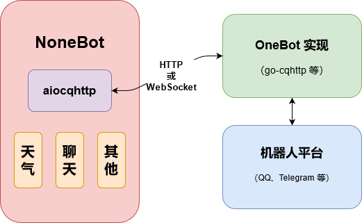

# 概览

> **提示**
>
> 如果在阅读本文档时遇到难以理解的词汇，请随时查阅 [术语表](../glossary.md) 或使用 [Google 搜索](https://www.google.com/ncr)。

> **提示**
>
> 初次使用时可能会觉得这里的概览过于枯燥，可以先简单略读之后直接前往 [安装](./installation.md) 查看安装方法，并进行后续的基础使用教程。

NoneBot 是一个 Python 的异步 QQ 机器人框架，它会对 QQ 机器人收到的消息进行解析和处理，并以插件化的形式，分发给消息所对应的命令处理器和自然语言处理器，来完成具体的功能。

除了起到解析消息的作用，NoneBot 还为插件提供了大量实用的预设操作和权限控制机制，尤其对于命令处理器，它更是提供了完善且易用的会话机制和内部调用机制，以分别适应命令的连续交互和插件内部功能复用等需求。

NoneBot 在其底层交互的部分使用 [aiocqhttp](https://github.com/nonebot/aiocqhttp) 库，后者是 [OneBot](https://github.com/botuniverse/onebot) 的一个 Python 异步 SDK，采用异步 I/O，封装了 Web 服务器相关的代码，支持 OneBot 的 HTTP 和反向 WebSocket 两种通信方式，让使用 Python 的开发者能方便地开发插件。

得益于 Python 的 [asyncio](https://docs.python.org/3/library/asyncio.html) 机制，NoneBot 处理消息的吞吐量有了很大的保障，再配合 go-cqhttp 插件可选的反向 WebSocket 通信方式（也是最建议的通信方式），NoneBot 的性能可以达到 HTTP 通信方式的两倍以上，相较于传统同步 I/O 的 HTTP 通信，更是有质的飞跃。

需要注意的是，NoneBot 仅支持 Python 3.7+ 及 OneBot v11 版本的 OneBot 实现，建议使用 go-cqhttp 插件。

## 它如何工作？

NoneBot 的运行离不开 OneBot 标准，当用户编写的程序实现了 OneBot v11 标准就可以使用 NoneBot。以 go-cqhttp 插件为例，它直接与 QQ 服务器通信，进行实际的消息、通知、请求的接收和发送。当 go-cqhttp 收到消息时，它将这个消息包装为一个事件（通知和请求同理），并根据其配置中的 `ws-reverse` 里的 `universal` 地址来将事件发送至 NoneBot。

在 NoneBot 收到事件前，它底层的 aiocqhttp 实际已经先看到了事件，aiocqhttp 根据事件的类型信息，通知到 NoneBot 的相应函数。特别地，对于消息类型的事件，还将消息内容转换成了 `aiocqhttp.message.Message` 类型，以便处理。

NoneBot 的事件处理函数收到通知后，对于不同类型的事件，再做相应的预处理和解析，然后调用对应的插件，并向其提供适合此类事件的会话（Session）对象。NoneBot 插件的编写者要做的，就是利用 Session 对象中提供的数据，在插件的处理函数中实现所需的功能。

## 示意图

## 特色

- 基于异步 I/O
- 同时支持 HTTP 和反向 WebSocket 通信方式
- 支持命令、自然语言处理器等多种插件形式
- 支持多个机器人账号负载均衡
- 提供直观的交互式会话接口
- 命令和自然语言处理器提供权限控制机制
- 支持在命令会话运行过程中切换到其它命令或自然语言处理器
- 多种方式渲染要发送的消息内容，使对话足够自然
